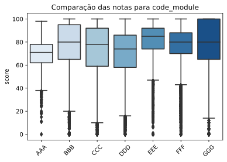
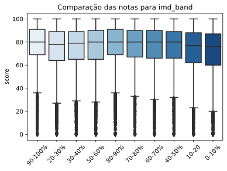

# Informações ao avaliador:
#### Quais as principais características da base de dados
- Há muitos outliers em toda a distribuição (ver EDA), 
- A base é facilmente agrupável e de entidades normalizadas, 
- A base está dividida em 3 categorias:
    - Registros de atividades dos estudantes;
    - Base de cursos e provas realizadas;
    - Demografia e informações dos estudantes 

#### Problema de negócio
Prever nota (score) por regressão.
- Como? Utilizando das principais informações socioeconômicas, demográficas, tipo de teste e engajamento de cliques do estudante para prever a nota.

#### Modelo utilizado
RandomForestRegressor
- Motivo: por ser do médoto ensemble, lida bem com variáveis mistas (numéricas e categóricas)

#### Como avalio os resultados
O modelo de baseline conseguiu identificar de forma adequada os valores de provas deixadas em branco e errou em erro médio absoluto aproximadamente 10 pontos entre valores verdadeiros e preditos.  
O modelo pode ser facilmente melhorado em novas iterações utilizando feature selection, algumas das variáveis não pesaram no critério de decisão da Random Forest (ver Resultados).


Segue código da solução.

# Setup


```python
import numpy as np
import pandas as pd
import matplotlib.pyplot as plt
import seaborn as sns
from sklearn.model_selection import train_test_split as tts 
from sklearn.preprocessing import LabelEncoder
from sklearn.ensemble import RandomForestRegressor
from sklearn.preprocessing import RobustScaler
```

## Importando o conjunto de dados


```python
# ! wget https://analyse.kmi.open.ac.uk/open_dataset/download --no-check-certificate && mv download download.zip && unzip download.zip && rm download.zip
```


```python
assessments = pd.read_csv('assessments.csv')
courses = pd.read_csv('courses.csv')
student_assessment = pd.read_csv('studentAssessment.csv')
student_info = pd.read_csv('studentInfo.csv')
student_registration = pd.read_csv('studentRegistration.csv')
student_vle = pd.read_csv('studentVle.csv')
vle = pd.read_csv('vle.csv')
```

## Unificando as bases de dados


```python
student_vle_grouped = student_vle.groupby(['id_student', 'code_module', 'code_presentation']).sum().drop(columns=['id_site', 'date'])
student_vle_grouped.head(2)
```


<div>
<style scoped>
    .dataframe tbody tr th:only-of-type {
        vertical-align: middle;
    }

    .dataframe tbody tr th {
        vertical-align: top;
    }

    .dataframe thead th {
        text-align: right;
    }
</style>
<table border="1" class="dataframe">
  <thead>
    <tr style="text-align: right;">
      <th></th>
      <th></th>
      <th></th>
      <th>sum_click</th>
    </tr>
    <tr>
      <th>id_student</th>
      <th>code_module</th>
      <th>code_presentation</th>
      <th></th>
    </tr>
  </thead>
  <tbody>
    <tr>
      <th>6516</th>
      <th>AAA</th>
      <th>2014J</th>
      <td>2791</td>
    </tr>
    <tr>
      <th>8462</th>
      <th>DDD</th>
      <th>2013J</th>
      <td>646</td>
    </tr>
  </tbody>
</table>
</div>


```python
student_info_vle = pd.merge(student_info, student_vle_grouped, how='left', left_on=('id_student', 'code_module', 'code_presentation'), right_on=('id_student', 'code_module', 'code_presentation'))
student_info_vle.head(2)
```


<div>
<style scoped>
    .dataframe tbody tr th:only-of-type {
        vertical-align: middle;
    }

    .dataframe tbody tr th {
        vertical-align: top;
    }

    .dataframe thead th {
        text-align: right;
    }
</style>
<table border="1" class="dataframe">
  <thead>
    <tr style="text-align: right;">
      <th></th>
      <th>code_module</th>
      <th>code_presentation</th>
      <th>id_student</th>
      <th>gender</th>
      <th>region</th>
      <th>highest_education</th>
      <th>imd_band</th>
      <th>age_band</th>
      <th>num_of_prev_attempts</th>
      <th>studied_credits</th>
      <th>disability</th>
      <th>final_result</th>
      <th>sum_click</th>
    </tr>
  </thead>
  <tbody>
    <tr>
      <th>0</th>
      <td>AAA</td>
      <td>2013J</td>
      <td>11391</td>
      <td>M</td>
      <td>East Anglian Region</td>
      <td>HE Qualification</td>
      <td>90-100%</td>
      <td>55&lt;=</td>
      <td>0</td>
      <td>240</td>
      <td>N</td>
      <td>Pass</td>
      <td>934.0</td>
    </tr>
    <tr>
      <th>1</th>
      <td>AAA</td>
      <td>2013J</td>
      <td>28400</td>
      <td>F</td>
      <td>Scotland</td>
      <td>HE Qualification</td>
      <td>20-30%</td>
      <td>35-55</td>
      <td>0</td>
      <td>60</td>
      <td>N</td>
      <td>Pass</td>
      <td>1435.0</td>
    </tr>
  </tbody>
</table>
</div>


```python
student_assessment_assessment = pd.merge(assessments, student_assessment, how='left', left_on=('id_assessment'), right_on=('id_assessment'))
student_assessment_assessment.head(2)
```


<div>
<style scoped>
    .dataframe tbody tr th:only-of-type {
        vertical-align: middle;
    }

    .dataframe tbody tr th {
        vertical-align: top;
    }

    .dataframe thead th {
        text-align: right;
    }
</style>
<table border="1" class="dataframe">
  <thead>
    <tr style="text-align: right;">
      <th></th>
      <th>code_module</th>
      <th>code_presentation</th>
      <th>id_assessment</th>
      <th>assessment_type</th>
      <th>date</th>
      <th>weight</th>
      <th>id_student</th>
      <th>date_submitted</th>
      <th>is_banked</th>
      <th>score</th>
    </tr>
  </thead>
  <tbody>
    <tr>
      <th>0</th>
      <td>AAA</td>
      <td>2013J</td>
      <td>1752</td>
      <td>TMA</td>
      <td>19.0</td>
      <td>10.0</td>
      <td>11391.0</td>
      <td>18.0</td>
      <td>0.0</td>
      <td>78.0</td>
    </tr>
    <tr>
      <th>1</th>
      <td>AAA</td>
      <td>2013J</td>
      <td>1752</td>
      <td>TMA</td>
      <td>19.0</td>
      <td>10.0</td>
      <td>28400.0</td>
      <td>22.0</td>
      <td>0.0</td>
      <td>70.0</td>
    </tr>
  </tbody>
</table>
</div>


```python
info_vle_assessment = pd.merge(student_info_vle, student_assessment_assessment, how='left', left_on=('id_student', 'code_module', 'code_presentation'), right_on=('id_student', 'code_module', 'code_presentation'))
info_vle_assessment.head(2)
```


<div>
<style scoped>
    .dataframe tbody tr th:only-of-type {
        vertical-align: middle;
    }

    .dataframe tbody tr th {
        vertical-align: top;
    }

    .dataframe thead th {
        text-align: right;
    }
</style>
<table border="1" class="dataframe">
  <thead>
    <tr style="text-align: right;">
      <th></th>
      <th>code_module</th>
      <th>code_presentation</th>
      <th>id_student</th>
      <th>gender</th>
      <th>region</th>
      <th>highest_education</th>
      <th>imd_band</th>
      <th>age_band</th>
      <th>num_of_prev_attempts</th>
      <th>studied_credits</th>
      <th>disability</th>
      <th>final_result</th>
      <th>sum_click</th>
      <th>id_assessment</th>
      <th>assessment_type</th>
      <th>date</th>
      <th>weight</th>
      <th>date_submitted</th>
      <th>is_banked</th>
      <th>score</th>
    </tr>
  </thead>
  <tbody>
    <tr>
      <th>0</th>
      <td>AAA</td>
      <td>2013J</td>
      <td>11391</td>
      <td>M</td>
      <td>East Anglian Region</td>
      <td>HE Qualification</td>
      <td>90-100%</td>
      <td>55&lt;=</td>
      <td>0</td>
      <td>240</td>
      <td>N</td>
      <td>Pass</td>
      <td>934.0</td>
      <td>1752.0</td>
      <td>TMA</td>
      <td>19.0</td>
      <td>10.0</td>
      <td>18.0</td>
      <td>0.0</td>
      <td>78.0</td>
    </tr>
    <tr>
      <th>1</th>
      <td>AAA</td>
      <td>2013J</td>
      <td>11391</td>
      <td>M</td>
      <td>East Anglian Region</td>
      <td>HE Qualification</td>
      <td>90-100%</td>
      <td>55&lt;=</td>
      <td>0</td>
      <td>240</td>
      <td>N</td>
      <td>Pass</td>
      <td>934.0</td>
      <td>1753.0</td>
      <td>TMA</td>
      <td>54.0</td>
      <td>20.0</td>
      <td>53.0</td>
      <td>0.0</td>
      <td>85.0</td>
    </tr>
  </tbody>
</table>
</div>


```python
aux = pd.merge(info_vle_assessment, student_registration, how='left', left_on=('id_student', 'code_module', 'code_presentation'), right_on=('id_student', 'code_module', 'code_presentation'))
aux.columns
```


    Index(['code_module', 'code_presentation', 'id_student', 'gender', 'region',
           'highest_education', 'imd_band', 'age_band', 'num_of_prev_attempts',
           'studied_credits', 'disability', 'final_result', 'sum_click',
           'id_assessment', 'assessment_type', 'date', 'weight', 'date_submitted',
           'is_banked', 'score', 'date_registration', 'date_unregistration'],
          dtype='object')


### Salvando o conjunto de dados


```python
aux.to_csv('oula.csv', header=True, index_label=False)
```

### Carregando o conjunto de dados


```python
df = pd.read_csv('oula.csv')
```

# EDA

### Qual é a nota média dos estudantes por teste?


```python
sns.histplot(df.groupby('id_assessment')['score'].mean());
```


### Quantos testes em média os estudantes realizam?


```python
df.groupby('id_student').count()['id_assessment'].mean()
```


    6.041757859996526


- Com uma média tão baixa de registros, não conseguiremos utilizar métodos de análise de série temporal mais sofisticados como VAR ou VARIMA

### Verificando como se comportam as notas de estudantes que utilizaram nota previamente armazenada (id_banked = 1)


```python
print('número de notas reutilizadas:', df[df.is_banked == 1]['is_banked'].sum())
```

    número de notas reutilizadas: 1909.0


## Como é o perfil dos estudantes com notas reutilizadas?


```python
students_with_banked_scores = df[df.is_banked == 1]['id_student'].unique()
```


```python
df[df.id_student == students_with_banked_scores[2]][['id_student', 'is_banked', 'score']]
```


<div>
<style scoped>
    .dataframe tbody tr th:only-of-type {
        vertical-align: middle;
    }

    .dataframe tbody tr th {
        vertical-align: top;
    }

    .dataframe thead th {
        text-align: right;
    }
</style>
<table border="1" class="dataframe">
  <thead>
    <tr style="text-align: right;">
      <th></th>
      <th>id_student</th>
      <th>is_banked</th>
      <th>score</th>
    </tr>
  </thead>
  <tbody>
    <tr>
      <th>189</th>
      <td>129955</td>
      <td>0.0</td>
      <td>85.0</td>
    </tr>
    <tr>
      <th>190</th>
      <td>129955</td>
      <td>0.0</td>
      <td>82.0</td>
    </tr>
    <tr>
      <th>191</th>
      <td>129955</td>
      <td>0.0</td>
      <td>76.0</td>
    </tr>
    <tr>
      <th>1795</th>
      <td>129955</td>
      <td>1.0</td>
      <td>85.0</td>
    </tr>
    <tr>
      <th>1796</th>
      <td>129955</td>
      <td>1.0</td>
      <td>82.0</td>
    </tr>
    <tr>
      <th>1797</th>
      <td>129955</td>
      <td>1.0</td>
      <td>76.0</td>
    </tr>
  </tbody>
</table>
</div>


- is_banked pode ser utilizada para substituir com exatidão a nota de estudantes
- a flag date_submitted -1 indica uso de is_banked, podemos usar qualquer um dos dois pra sinalizar o uso de nota anterior
- o valor da nota do estudante ao utilizar is_banked será a primeira nota registrada e assim em diante (score em t+0)

## PROBLEMA DE NEGÓCIO: Como predizer o desempenho dos estudantes nas avaliações finais?


```python
def score_comparison(by):
  sns.boxplot(x=df[by].values, y=df['score'], palette='Blues')
  plt.xticks(rotation=45)
  plt.title(f'Comparação das notas para {by}')
  plt.show()
```


```python
score_comparison('code_module')
```





- Grande variabilidade, cada modulo tem um alcance de notas distinto. Será uma feature muito importante para nosso modelo!


```python
score_comparison('gender')
```


- Inconclusivo, há pouca diferença entre categorias


```python
score_comparison('highest_education')
```


- Quanto maior é o grau de estudo, maior é a nota média dos estudantes.


```python
score_comparison('age_band')
```


- Inconclusivo, há pouca diferença entre categorias


```python
score_comparison('region')
```


- Inconclusivo, há pouca diferença entre categorias


```python
score_comparison('imd_band')
```





- Quanto menor é o índice de deprivação (IMD) menor é a nota média do estudante


```python
score_comparison('disability')
```


- Aparentemente PNEs possuem nota média inferior, porém não vamos utilizar isso como classificador em nosso modelo. Além disso, a diferença é pequena


```python
score_comparison('assessment_type')
```


- Bastante diferença entre notas para cada um dos teste, verificamos que os testes de treino (Exam) recebem uma nota ligeiramente menor que as demais provas

# ML

## Feature Engineering
- Vamos criar um campo binário que aponta se um estudante desistiu do curso (contém date_unregistration)


```python
df['unregistered'] = df['date_unregistration'].notnull()
```

## Seleção de Features do Modelo de Baseline
- Vamos utilizar como features iniciais as variáveis que obtiveram as melhores notas em correlação, tanto positiva quanto negativa
- Vamos utilizar o campo *id_student*, pois se for requisitada nova nota de um estudante já existente na base, o modelo já terá conhecimento prévio de notas anteriores daquele estudante.


```python
df.corr(method='pearson')['score'].drop(index='score').sort_values(ascending=False)
```


    sum_click               0.188467
    date                    0.078527
    id_assessment           0.072495
    id_student              0.024149
    date_registration       0.017996
    date_unregistration     0.014398
    is_banked              -0.008149
    date_submitted         -0.033893
    studied_credits        -0.047556
    num_of_prev_attempts   -0.065964
    unregistered           -0.146550
    weight                 -0.166416
    Name: score, dtype: float64


```python
df.corr(method='spearman')['score'].drop(index='score').sort_values(ascending=False)
```


    sum_click               0.194984
    date                    0.074814
    id_assessment           0.059582
    id_student              0.048362
    date_registration       0.016716
    date_unregistration    -0.005155
    is_banked              -0.012915
    date_submitted         -0.040422
    studied_credits        -0.055049
    num_of_prev_attempts   -0.070041
    unregistered           -0.123670
    weight                 -0.199866
    Name: score, dtype: float64


```python
X = df.drop(columns=['score', 'gender', 'region', 'date', 'disability'])
y = df['score']

X_prep = X.apply(lambda x: x.replace(np.nan, 0))
y_prep = y.fillna(0)
```

## Pré processamento


### Encoding
- Vamos encodar numericamente os estudantes em ordem de aparição, os campos de resultados finais e tipo de prova


```python
enc = LabelEncoder()

X_prep['id_student'] = enc.fit_transform(X_prep['id_student'])
X_prep['code_presentation'] = enc.fit_transform(X_prep['code_presentation'])

X_prep = pd.get_dummies(X_prep, columns=['final_result', 'assessment_type', 'highest_education', 'imd_band', 'code_module', 'age_band'], drop_first=True)

X_train, X_test, y_train, y_test = tts(X_prep, y_prep, train_size=0.7)
```

### Scaling
- Vamos utilizar um scaler robusto a outliers, porque verificamos pela EDA a existência de muitos outliers em nosso dataset


```python
rs = RobustScaler()

rs.fit(X_train)
X_train_scaled = rs.transform(X_train)
X_test_scaled = rs.transform(X_test)
```

## Treinamento do Modelo
- Utilizaremos um método de ensemble, que é facilmente ajustável a features mistas (numéricas, categóricas)


```python
rf = RandomForestRegressor(criterion='mse', max_depth=15, random_state=42, n_jobs=-1)

rf.fit(X_train_scaled, y_train)
results = rf.predict(X_test_scaled)
```

# Resultados

## Features por importância


```python
[[round(i, 5), j] for (i, j) in zip(rf.feature_importances_, X_train.columns)]
```


    [[0.00401, 'code_presentation'],
     [0.03258, 'id_student'],
     [0.00384, 'num_of_prev_attempts'],
     [0.0087, 'studied_credits'],
     [0.06481, 'sum_click'],
     [0.5491, 'id_assessment'],
     [0.04203, 'weight'],
     [0.06229, 'date_submitted'],
     [0.00022, 'is_banked'],
     [0.02883, 'date_registration'],
     [0.00989, 'date_unregistration'],
     [0.00077, 'unregistered'],
     [0.05829, 'final_result_Fail'],
     [0.03289, 'final_result_Pass'],
     [0.02104, 'final_result_Withdrawn'],
     [0.03285, 'assessment_type_CMA'],
     [8e-05, 'assessment_type_Exam'],
     [0.00244, 'assessment_type_TMA'],
     [0.00263, 'highest_education_HE Qualification'],
     [0.00402, 'highest_education_Lower Than A Level'],
     [0.00134, 'highest_education_No Formal quals'],
     [0.00055, 'highest_education_Post Graduate Qualification'],
     [0.00326, 'imd_band_0-10%'],
     [0.00265, 'imd_band_10-20'],
     [0.00222, 'imd_band_20-30%'],
     [0.00221, 'imd_band_30-40%'],
     [0.00204, 'imd_band_40-50%'],
     [0.00225, 'imd_band_50-60%'],
     [0.00181, 'imd_band_60-70%'],
     [0.00186, 'imd_band_70-80%'],
     [0.00196, 'imd_band_80-90%'],
     [0.00164, 'imd_band_90-100%'],
     [0.00084, 'code_module_BBB'],
     [0.00134, 'code_module_CCC'],
     [0.00276, 'code_module_DDD'],
     [0.0019, 'code_module_EEE'],
     [0.00269, 'code_module_FFF'],
     [0.00171, 'code_module_GGG'],
     [0.00326, 'age_band_35-55'],
     [0.00038, 'age_band_55<=']]


### Como está a previsão do modelo?


```python
prediction = pd.DataFrame()
prediction['results'] = list(results)
prediction['true'] = list(y_test)
```


```python
print('Taxa de erros em previsão de nulos:')
sum(sum([prediction[prediction['true'] == 0]['results'] != 0])) / prediction.shape[0]
```

    Taxa de erros em previsão de nulos:


    0.0024908208638535767


- O modelo está prevendo valores nulos corretamente! (Utilizando *assessment_type*)

### Distribuição de valores verdadeiros x preditos


```python
sns.kdeplot(prediction.true)
sns.kdeplot(prediction.results)
plt.legend(['verdadeiros', 'preditos'])
plt.xlabel('nota')
plt.title('Distribuição de valores verdadeiros x preditos');
```


- A média de valores verdadeiros se aproxima da média dos valores preditos, porém o modelo tem dificuldade em prever notas acima de 90 pontos e está aparentemente enviesado entre 65-75 (picos)


```python
from sklearn.metrics import mean_squared_error, mean_absolute_error, explained_variance_score
pd.DataFrame({
    'mse': mean_squared_error(y_test, results, squared=False),
    'mae': mean_absolute_error(y_test, results),
    'evar': explained_variance_score(y_test, results)
}, index=[0])
```


<div>
<style scoped>
    .dataframe tbody tr th:only-of-type {
        vertical-align: middle;
    }

    .dataframe tbody tr th {
        vertical-align: top;
    }

    .dataframe thead th {
        text-align: right;
    }
</style>
<table border="1" class="dataframe">
  <thead>
    <tr style="text-align: right;">
      <th></th>
      <th>mse</th>
      <th>mae</th>
      <th>evar</th>
    </tr>
  </thead>
  <tbody>
    <tr>
      <th>0</th>
      <td>14.648758</td>
      <td>10.627565</td>
      <td>0.606893</td>
    </tr>
  </tbody>
</table>
</div>


### O quanto o modelo está errando em relação aos valores verdadeiros?


```python
prediction['diff'] = abs(prediction.true - prediction.results)
sns.kdeplot(prediction['diff'])
plt.title('Distribuição de erros do modelo de regressão (quanto menor, melhor)');
```


## Escolhendo as melhores features com o feature selection


```python
# from sklearn.feature_selection import SelectFromModel
# from sklearn.metrics import mean_squared_error
# from sklearn.linear_model import LinearRegression, Ridge, Lasso
# from sklearn.ensemble import RandomForestRegressor

# # Feature Selection
# k_vs_score=[]
# seed = 42

# for k in range(2, X_train.shape[1], 2):
#     # selector_model = LinearRegression(normalize=True)
#     # selector_model = Ridge(alpha=0.1, normalize=True, random_state=seed)
#     selector_model = Lasso(alpha=1.,normalize=True, random_state=seed)
#     # selector_model = RandomForestRegressor(criterion='mse', random_state=seed, n_jobs=-1)

#     selector = SelectFromModel(selector_model, max_features=k, threshold=-np.inf)
    
#     selector.fit(X_train_scaled, y_train)
#     X_train_2 = selector.transform(X_train)

#     X_test_2 = selector.transform(X_test_scaled)

#     model = RandomForestRegressor(criterion='mse', n_estimators=100, random_state=seed, n_jobs=-1, max_depth=9)
#     model.fit(X_train_2, y_train)

#     p = model.predict(X_test_2)

#     score = explained_variance_score(y_test, p)
#     print(f"k = {k}; EVAR = {score}")

#     mask = selector.get_support()
#     print(X_train.columns[mask])
#     k_vs_score.append(score)
```

## Reprodutibilidade


```python
! pip freeze > requirements.txt
```


```python
! jupyter nbconvert oula.ipynb --to markdown --output README.md
```
